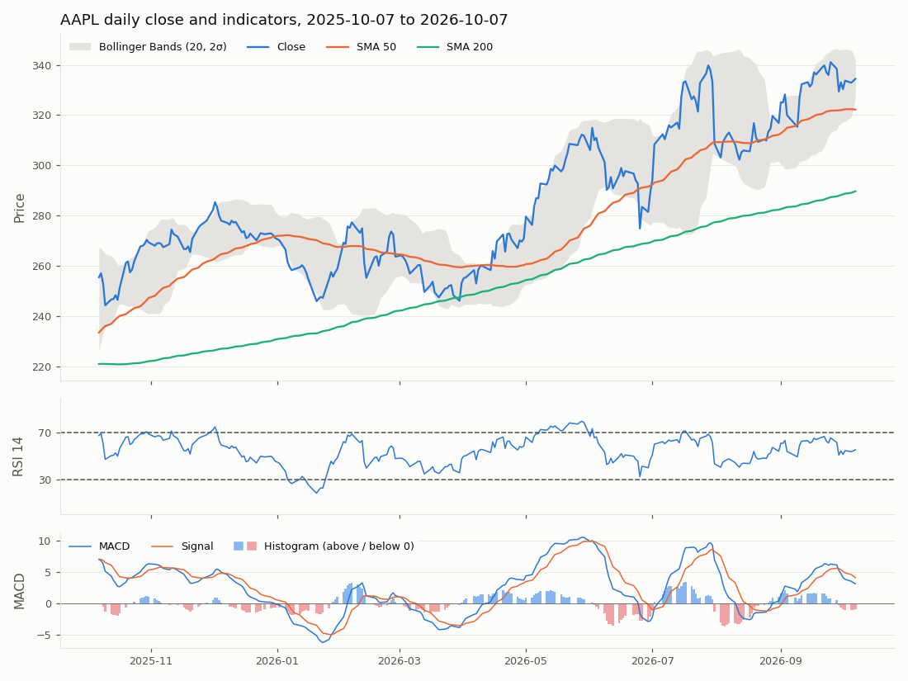

# Apple Inc. (AAPL): equity research brief

Generated 2026-10-07 09:55 EDT · market data as of 2026-10-07

## Company snapshot

| Measure | Value |
|---|---|
| Current price | 334.42 USD |
| 52-week high | 345.34 USD |
| 52-week low | 242.76 USD |
| P/E ratio (trailing) | 38.3 |
| Year-to-date return | +23.4% |
| Momentum signal (rule-based) | Bullish (score +3 of ±5) |

## Technical outlook

- Close: 334.42 USD
- Close vs 50-day SMA (322.19): +3.8%
- Close vs 200-day SMA (289.72): +15.4%
- 50-day SMA vs 200-day SMA: +11.2% now, +12.1% 10 trading days ago (gap narrowing)
- RSI-14: 55.4 now, 54.4 5 trading days ago (rising); overbought above 70, oversold below 30
- MACD: 3.10, signal line 4.07 (MACD below the signal line); histogram -0.96 now, -1.05 the day before (rising)
- Bollinger %B: 0.50 (0 is the lower band, 1 the upper band; outside 0 to 1 is outside the bands)
- 52-week range: low 242.76, high 345.34; close at 89% of the range
- 30-day annualised volatility: 21.0%
- Year-to-date return: +23.4%

## News sentiment

**Sentiment score: -0.41 (negative)** on a scale from -1 to +1, the mean of 14 headlines from the last 7 days: 1 positive, 8 negative, 5 neutral.

Top 3 headlines by strength of sentiment:

1. **Apple (NASDAQ:AAPL) Stock: Insider Timothy Cook Sells 191,753 Shares** (MarketBeat, 2026-10-05): negative, score -0.92. Significant insider selling may signal lack of confidence, pressuring the share price.
2. **21,189 Apple Inc. $AAPL Shares Purchased by Munich Reinsurance Co Stock Corp in Munich** (MarketBeat, 2026-10-07): positive, score +0.90. Institutional buying signals demand and confidence, likely supporting the share price.
3. **Apple’s New CEO Just Sold $8.5 Million of Stock** (24/7 Wall St., 2026-10-07): negative, score -0.88. Insider selling by the CEO suggests reduced confidence, likely pressuring the share price.

## Recommendation: Hold over the next 90 days

Apple is trading well above both the 50‑day and 200‑day moving averages, confirming a solid uptrend, but the gap between the two averages has narrowed, hinting that the trend may be losing steam. The MACD remains below its signal line, indicating bearish momentum, yet the histogram is rising, suggesting that the negative momentum is easing. RSI is in a neutral zone and Bollinger %B sits at the midpoint, so the price is not stretched and there is no immediate overbought pressure. The recent negative news sentiment adds a downside bias that offsets the still‑positive trend, leading to an ambiguous outlook for the next three months.

**Key factors**

- Price above 50‑day and 200‑day SMA with narrowing gap – weakening uptrend
- MACD below signal line but rising histogram – fading momentum
- RSI neutral and Bollinger %B at 0.5 – no stretch
- Negative news sentiment – adds downside pressure

## How this brief was made

- Indicators computed from first principles with pandas and numpy: SMA 50 and 200, RSI 14 (Wilder), MACD (12, 26, 9), Bollinger Bands (20, 2 standard deviations).
- Headline sentiment labelled by Jev for 0 headlines and by the LLM for 14; 1 could not be scored.
- Recommendation written by openai/gpt-oss-120b via groq, from the computed facts above and the Sentiment score.

## Data notes

- no AAPL yahoo news after 3 attempts (last problem: HTTPError: HTTP Error 429: Too Many Requests); check the ticker symbol or try later
- Jev was unavailable for 14 headlines, so the LLM labelled them
- 1 headlines could not be scored and are left out of the Sentiment score

---

**Risk disclaimer.** This brief was generated automatically from public market data and news headlines, with language models writing the reasoning. It is for information and assessment purposes only and is not investment advice, a solicitation, or a recommendation to buy or sell any security. Indicators describe past prices and do not predict future returns; headlines can be incomplete, late or wrong, and the models can misread them. Do your own research or consult a licensed adviser before making any investment decision.
